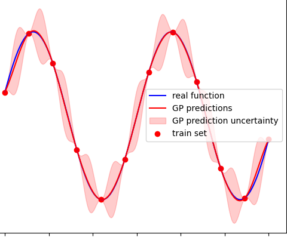

- [What is this library about](#intro)
- [Usage](#usage)
- [Features](#features)
- [CMake support](#cmake-support)




## INTRO

This library provides a modern **C++** interface that allows you to use and train **Gaussian Processes**, aka **GP**.
If you believe to be not really familiar with this kind of models, it is strongly recommended to have a look at these useful tutorials:

- [Gaussian Processes](https://www.youtube.com/watch?v=UBDgSHPxVME&t=794s)
- [Easy introduction to gaussian process regression](https://www.youtube.com/watch?v=iDzaoEwd0N0)

... and read the documentation [here](doc/Gaussian_Process.pdf). If you have found this library useful, take the time to leave a **star** ;).

Scalar and Vectorial multivariate functions can be both approximated using the kind of **GP**s implemented in this package.

This library uses [**Eigen**](https://gitlab.com/libeigen/eigen) as internal linear algebra engine. Check [here](#cmake-support) for more details.

## USAGE

Haven't already left a **star**? Do it now! ;).

Use this package is straightforward.

First of all, you need to define and build a **kernel function**:
```cpp
#include <GaussianProcess/GaussianProcess.h>
#include <GaussianProcess/kernel/SquaredExponential.h>

// for the purpose of this example we will use a simple squared exponential
  gauss::gp::KernelFunctionPtr kernel_function =
      std::make_unique<gauss::gp::SquaredExponential>(1.0, 1.0);
```

You can now build an empty **GP** passing the previously defined **kernel function**:
```cpp
    // The input size of the process will be 3, while the output will be 2, i.e.
    // this process will be able to approximate a tri-variate vectorial function
    // made of 2 components.
    gauss::gp::GaussianProcess gauss_process(std::move(kernel_function),
                                            3 // input size
                                            ,
                                            2 // output size
    );
```

An empty **GP** is useless untill you don't define its training set. Therefore, add some samples to the training set:
```cpp
  // fill the training set of the process with samples taken from the (unknown)
  // function to approximate
  std::vector<Eigen::VectorXd> samples =
      ...; // each element will be a 5 sized vector, whose first 3 components
           // represent the values of the input, while the other ones the values
           // of the output
  for (const auto &sample_to_add : samples) {
    gauss_process.getTrainSet().addSample(sample_to_add);
  }
```

You can now use the **GP** to make predictions:
```cpp
    // predict the output for an input not contained in the training set
    Eigen::VectorXd input_to_predict = ...;
    std::vector<gauss::GaussianDistribution>
        predicted_output // each component is a scalar guassian distribution
                         // with a certain mean and covariance matrix
        = gauss_process.predict(input_to_predict,
                                gauss::gp::VECTORIAL_PREDICTION_TAG);
```
You can also access the prediction as a unique multivariate distribution (notice that the covariance matrix of such distribution will be in identity matrix multiplied by a certain factor):
```cpp
    // access the prediction as a unique multivariate vectorial guassian
    // distribution
    gauss::GaussianDistribution predicted_output = gauss_process.predict(
        input_to_predict, gauss::gp::SINGLE_PREDICTIVE_DISTRIBUTION_TAG);
```

Not satisfied about the prediciton performance? Maybe the hyperparameters of the **kernel function** are badly set. Try to train the model:
```cpp
#include <TrainingTools/iterative/solvers/GradientDescend.h>

  // optimize the hyperparameters through training in order to improve
  // predicting performance.
  ::train::GradientDescendFixed
      gradient_descender; // you can also use another trainer from
  // TrainingTools, or define your own
  gauss::gp::train(gauss_process, gradient_descender);
```

## FEATURES

Haven't already left a **star**? Do it now! ;).

With respect to similar repositories, this library allows you to:
- dynamically add new samples to the training set of a **gaussian process** without having to define it once for all
- access the **covariance kernel matrix** as well as its decomposition and inverse.
- use one of the ready to go standard **kernel function** defined [here](src/header/GaussianProcess/kernel/)
- define your own **kernel function** and build a **gaussian process** using it
- train the **gaussian process** with the **gradient descend** approaches provided by [this](https://github.com/andreacasalino/TrainingTools) external package.
- specify a prior distribution (for the moment only a **multivariate Gaussian**) over the hyperparameters, which is taken into accoutn when training.

## CMAKE SUPPORT

Haven't already left a **star**? Do it now! ;).


This package is completely **cross-platform** and to consume this library you can rely on [CMake](https://cmake.org).
More precisely, You can fetch this package and link to the **EFG** library:
```cmake
include(FetchContent)
FetchContent_Declare(
gauss_process
GIT_REPOSITORY https://github.com/andreacasalino/GaussianProcesses
GIT_TAG        master
)
FetchContent_MakeAvailable(gauss_process)
```

and then link to the **GP** library:
```cmake
target_link_libraries(${TARGET_NAME}
   GaussianProcess
)
```

This library uses [**Eigen**](https://gitlab.com/libeigen/eigen) as internal linear algebra engine. 
**Eigen** is by default [fetched](https://cmake.org/cmake/help/latest/module/FetchContent.html) and copied by **CMake** from the latest version on the official **Eigen** repository.
However, you can also use a local version, by [setting](https://www.youtube.com/watch?v=LxHV-KNEG3k&t=1s) the **CMake** option **EIGEN_INSTALL_FOLDER** equal to the root folder storing the local **Eigen** you want to use.
